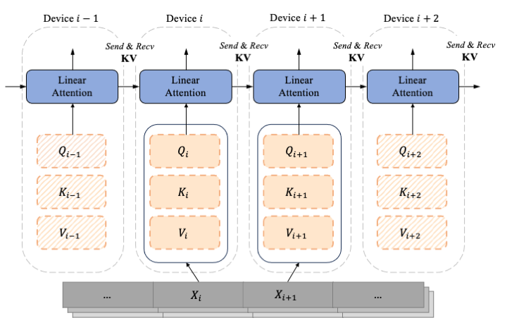

# Linear Attention Sequence Parallelism (LASP)

<p align="center">
💻 <a href="https://github.com/OpenNLPLab/LASP" target="_blank">GitHub </a> •
💬 <a href="https://discord.gg/JEU3nTcWKC" target="_blank">Discord</a> •
💬 <a href="./images/contact_me_qr.png" target="_blank">WeChat</a>
</p>

This repo provides the implementation of Linear Attention Sequence Parallelism (Paper: https://arxiv.org/abs/).

<center>
    
    <br>
    <div style="color:orange; border-bottom: 1px solid #d9d9d9;
    display: inline-block;
    color: #999;
    padding: 2px;">Linear Attention Sequence Parallelism (LASP)</div>
</center>


## Abstract

Sequence Parallel (SP) serves as a prevalent strategy to handle long sequences that exceed the memory limit of a single GPU. However, existing SP methods do not take advantage of linear attention features, resulting in sub-optimal parallelism efficiency and usability for linear attention-based language models. In this paper, we introduce Linear Attention Sequence Parallel (LASP), an efficient SP method tailored to linear attention-based language models. Specifically, we design an efficient point-to-point communication mechanism to leverage the right-product kernel trick of linear attention, which sharply decreases the communication overhead of SP. We also enhance the practical efficiency of LASP by performing kernel fusion and intermediate state caching, making the implementation of LASP hardware-friendly on GPU clusters. Furthermore, we meticulously ensure the compatibility of sequence-level LASP with all types of batch-level data parallel methods, which is vital for distributed training on large clusters with long sequences and large batches.
We conduct extensive experiments on two linear attention-based models with varying sequence lengths and GPU cluster sizes. LASP scales sequence length up to 4096K using 128 A100 80G GPUs on 1B models, which is 8$\times$ longer than existing SP methods while being significantly faster.


## Installation
The code only depends on `torch` and `triton`, it has been tested with `torch==2.1.1`, `triton==2.0.0` and `triton-nightly==2.1.0.dev20230728172942` on A100 and 3090 GPU platforms.

We recommend you to install `triton` and `triton-nightly` using the following commands:
```
pip install triton==2.0.0
pip install triton-nightly==2.1.0.dev20230728172942 --index-url https://aiinfra.pkgs.visualstudio.com/PublicPackages/_packaging/Triton-Nightly/pypi/simple/
```

To install LASP from source, run:
```
git clone https://github.com/OpenNLPLab/LASP.git
cd LASP
# -e signified dev mode since e stands for editable
pip install -e .
```


## Code Structure

The code is organized as follows:
- `tests/` contains the launch script and test file for run testing.
- `lasp/` contains the implementation of lasp and its improved variants, including `lasp_native`, `lasp_cache`, `lasp_fuse`, `lasp_fuse_parallel` and the non-sequence parallel version: `lightning_attention`.
- `lasp/utils/` contains the communication manager for lasp, i.e., `seq_parallel_manager`, and other utils functions.

## Usage
The provided code supports the hybrid of Data Parallel (DP) (batch-level) and Sequence Parallel (SP) (sequence-level) on linear attention.
As an example, assume we have 1 node with 8 GPUs and the ranks are {0, 1, 2, 3, 4, 5, 6, 7}.
For data parallel size = 2 and sequence parallel size = 4, the DP and SP communication groups will be:

4 data_parallel groups (with global rank indices):
```
(0, 4), (1, 5), (2, 6), (3, 7)
```
2 sequence paralell groups (with global rank indices):
```
(0, 1, 2, 3), (4, 5, 6, 7)
```
In summary, the group maping (with their own rank indices) is as follows:
```
Global ranks:             0, 1, 2, 3, 4, 5, 6, 7
Data parallel ranks:      0, 0, 0, 0, 1, 1, 1, 1
Sequence parallel ranks:  0, 1, 2, 3, 0, 1, 2, 3
```

Run the following commands:
```
cd tests
bash script.sh
```

You will test LASP with randomly generated `Q, K, V` and `dO` under the following distributed cases sequentially:

| Parallel Type | Case1  | Case2 | Case3 | Case4 |
|-|-|-|-|-|
| Data Parallel Size | 1 | 2 | 4 | 8 |
| Sequence Parallel Size | 8 | 4 | 2 | 1 |

Other configuratures used in the test is batch size per device `b=2`, sequence length `n=2048`, number of heads `h=12` and head dim `d=128`. 

By running the test, you will get the mean difference values of `Oi`, `dQi`, `dKi` and `dVi` obtained by LASP, comparing with the reference values of Lightning Attention (see our lightning attention work at: https://github.com/OpenNLPLab/lightning-attention).

## Benchmark

### Difference Results on 4 A100 GPUs
Following is the difference results obtained by running `tests/script.sh` on 4 A100 GPUs, i.e., run:
```
for dp_size in 1 2 4
do
    START_TIME=`date +%Y%m%d-%H:%M:%S`

    LOG_FILE=${logger_dir}/${START_TIME}-dp-size-${dp_size}.log
    torchrun --nproc_per_node 4 \
    test.py --dp-size ${dp_size} \
    2>&1 | tee -a $LOG_FILE
done
```

Outputs:
```
Test lasp_naive on world size 4 with data_parallel_size 1 and sequence_parallel_size 4:
### Forward ###
out diff: mean value: 0.0
### Backward ###
dq diff: mean value: 0.016357421875
dk diff: mean value: 0.047119140625
dv diff: mean value: 0.06689453125


Test lasp_cache on world size 4 with data_parallel_size 1 and sequence_parallel_size 4:
### Forward ###
out diff: mean value: 0.0
### Backward ###
dq diff: mean value: 0.016357421875
dk diff: mean value: 0.047119140625
dv diff: mean value: 0.06689453125


Test lasp_fuse on world size 4 with data_parallel_size 1 and sequence_parallel_size 4:
### Forward ###
out diff: mean value: 0.051025390625
### Backward ###
dq diff: mean value: 0.0186767578125
dk diff: mean value: 0.021240234375
dv diff: mean value: 0.06396484375


Test lasp_fuse_parallel on world size 4 with data_parallel_size 1 and sequence_parallel_size 4:
### Forward ###
out diff: mean value: 0.0179443359375
### Backward ###
dq diff: mean value: 0.0205078125
dk diff: mean value: 0.025146484375
dv diff: mean value: 0.03564453125


Test lasp_naive on world size 4 with data_parallel_size 2 and sequence_parallel_size 2:
### Forward ###
out diff: mean value: 0.0
### Backward ###
dq diff: mean value: 0.0169677734375
dk diff: mean value: 0.04638671875
dv diff: mean value: 0.0654296875


Test lasp_cache on world size 4 with data_parallel_size 2 and sequence_parallel_size 2:
### Forward ###
out diff: mean value: 0.0
### Backward ###
dq diff: mean value: 0.0169677734375
dk diff: mean value: 0.04638671875
dv diff: mean value: 0.0654296875


Test lasp_fuse on world size 4 with data_parallel_size 2 and sequence_parallel_size 2:
### Forward ###
out diff: mean value: 0.05224609375
### Backward ###
dq diff: mean value: 0.0198974609375
dk diff: mean value: 0.021240234375
dv diff: mean value: 0.06396484375


Test lasp_fuse_parallel on world size 4 with data_parallel_size 2 and sequence_parallel_size 2:
### Forward ###
out diff: mean value: 0.0240478515625
### Backward ###
dq diff: mean value: 0.022705078125
dk diff: mean value: 0.0250244140625
dv diff: mean value: 0.035400390625


Test lasp_naive on world size 4 with data_parallel_size 4 and sequence_parallel_size 1:
### Forward ###
out diff: mean value: 0.0
### Backward ###
dq diff: mean value: 0.0172119140625
dk diff: mean value: 0.0172119140625
dv diff: mean value: 0.0244140625


Test lasp_cache on world size 4 with data_parallel_size 4 and sequence_parallel_size 1:
### Forward ###
out diff: mean value: 0.0
### Backward ###
dq diff: mean value: 0.0172119140625
dk diff: mean value: 0.0172119140625
dv diff: mean value: 0.0244140625


Test lasp_fuse on world size 4 with data_parallel_size 4 and sequence_parallel_size 1:
### Forward ###
out diff: mean value: 0.053466796875
### Backward ###
dq diff: mean value: 0.0205078125
dk diff: mean value: 0.0205078125
dv diff: mean value: 0.06298828125


Test lasp_fuse_parallel on world size 4 with data_parallel_size 4 and sequence_parallel_size 1:
### Forward ###
out diff: mean value: 0.027099609375
### Backward ###
dq diff: mean value: 0.02392578125
dk diff: mean value: 0.02392578125
dv diff: mean value: 0.033935546875
```


## Todo
- [x] Diff test
- [ ] Speed test


## Citation
If you find our work useful, please cite the following paper:
```
@misc{lasp,
      title={Linear Attention Sequence Parallelism},
      author={Weigao Sun and Zhen Qin and Dong Li and Xuyang Shen and Yu Qiao and Yiran Zhong},
      year={2024},
      eprint={},
      archivePrefix={arXiv},
      primaryClass={cs.CL}
}
```
